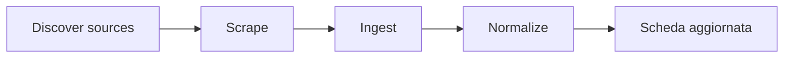

Le **Sorgenti Dati** sono URL e riferimenti usati dal crawler per acquisire e aggiornare informazioni sulle università e i percorsi.

## Dove trovarle

Menu laterale → **⚙️ Configurazione** → **Sorgenti Dati**

<Frame caption="Lista sorgenti dati">
  
</Frame>

<Note>
Area riservata agli **Admin** e al team tecnico. I redattori di solito non modificano le sorgenti.
</Note>

## Cosa rappresenta una sorgente

| Campo | Significato |
| --- | --- |
| **URL** | Indirizzo della pagina sorgente |
| **Università** | Ateneo collegato |
| **Tipo entità** | Laurea, master, corso, sedi, agevolazione, ecc. |
| **Attiva** | Se la sorgente è usata dal crawler |

## Collegamento con le università

Nella scheda **Università**, tab **Data sources**, vedi le sorgenti associate a quell'ateneo.

## Flusso operativo (panoramica)

Per il dettaglio tecnico vedi [Edge Functions](/piattaforma/edge-functions) e [Crawler](/crawler).

## Quando intervenire manualmente

- Verificare URL non più raggiungibili
- Disattivare sorgenti obsolete
- Segnalare al team crawler anomalie di acquisizione

## Guide correlate

- [Università](/admin/universita)
- [Crawler — panoramica](/crawler)
