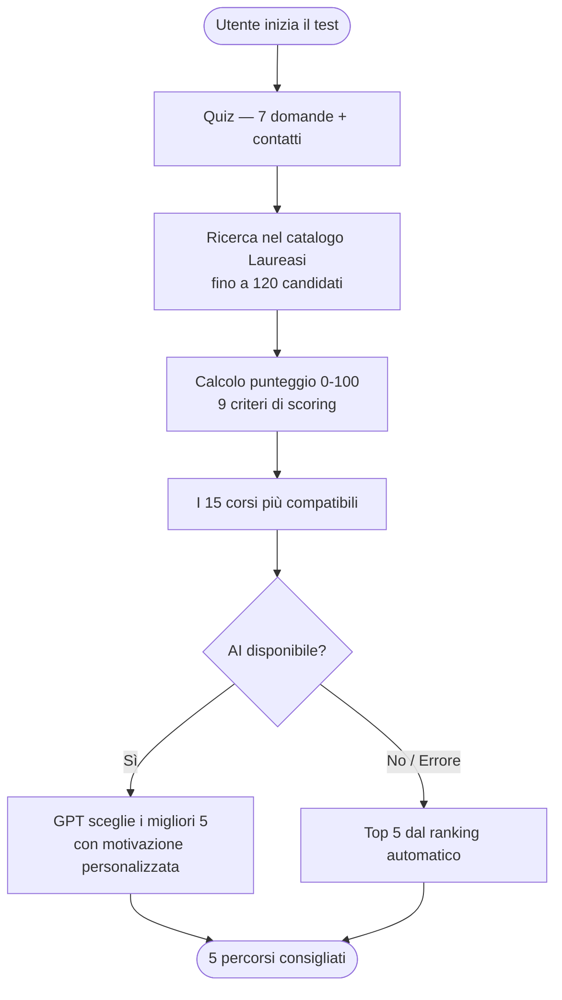
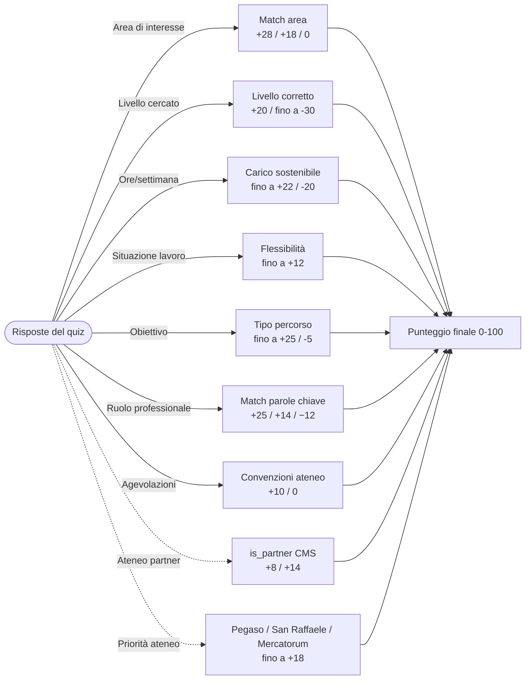

Questo documento descrive la logica con cui il **Test di Orientamento** di LaureaSì analizza le risposte dell'utente e propone i 5 percorsi più adatti.

L'algoritmo assegna un **punteggio di compatibilità (0–100)** a ogni corso presente nel catalogo, sommando contributi positivi e negativi in base a 9 criteri di scoring (7 dal quiz, 2 dal CMS). Il risultato finale può essere ulteriormente raffinato da un modello di **Intelligenza Artificiale (GPT)** che valuta sfumature semantiche non catturabili da un semplice score numerico.

## Diagramma 1 — Flusso generale

## Diagramma 2 — Criteri di punteggio

## Riepilogo criteri e pesi

| # | Criterio | Fonte | Range punti | Note |
| --- | --- | --- | --- | --- |
| 1 | Area di interesse | Domanda 3 | +28 / +18 / 0 | Sinonimi espansi automaticamente |
| 2 | Livello formativo | Domanda 4 | -30 → +20 | Penalità massima se livello sbagliato |
| 3 | Tempo disponibile | Domanda 6 | -20 → +22 | Corsi brevi vs lauree |
| 4 | Situazione lavorativa | Domanda 5 | 0 → +12 | Full-time, genitore, part-time |
| 5 | Obiettivo | Domanda 1 | -5 → +25 | Concorso, completare percorso, crescita |
| 6 | Ruolo professionale | Domanda 2 | 0 → +25 / +14 / −12 | Select professioni + Altro; sinonimi/alias sul catalogo |
| 7 | Agevolazioni | Passo 8 | 0 → +10 | Convenzioni ateneo compatibili; personalizzano anche il prezzo |
| 8 | Ateneo Partner | CMS `is_partner` | 0 → +14 | **Leva principale** per prioritizzare atenei |
| 9 | Priorità ateneo | ID università CMS | 0 → +18 | Pegaso +18, San Raffaele/Mercatorum +10 |

Per **crescita professionale** e **cambio carriera**, il ruolo si sceglie da una lista fissa (con campo **Altro** a testo libero). Il frontend invia un `matchText` arricchito; il ranking espande token con alias e sinonimi di dominio (`ROLE_TOKEN_ALIASES`, `ROLE_DOMAIN_SYNONYMS`) contro titolo, area e piano di studi.

**Nutrizione ≠ Gastronomia:** nel quiz l’area **Nutrizione** mappa ai percorsi CMS area `scienze-della-nutrizione` (es. LM-61 Scienze della Nutrizione Umana). **Gastronomia e ospitalità** resta separata (ospitalità / enogastronomia) e non deve espandersi verso dietetica o LM-61.

Le aree quiz (`giurisprudenza`, `formazione`, `politiche`, `motorie`, …) passano da `QUIZ_AREA_ALIASES` a chiavi `SYNONYMS` allineate al CMS. Si evitano espansioni ampie rumorose (`digitale`, `gestione`) nel prefiltro DB.

Il quality gate **non svuota più i risultati** se nel pool esistono percorsi compatibili col livello scelto: i candidati hard-incompatibili (es. corsi con quiz `magistrale`) vengono esclusi già in pre-filtro e, se serve, si fa **backfill** dal pool.

### Formazione Docenti e ruoli creativi

- `livello=docenti` resta hard-filter su `course`, ma i corsi TFA / CFU / classi di concorso (`A001`, `D.P.C.M.`, …) ricevono un **boost dedicato** (`getDocentiCourseBoost`).
- Il prompt AI chiarisce che `docenti` è una **tipologia di percorso**, non un’aspirazione a insegnare.
- In **crescita professionale**, il ruolo attuale guida retrieval e ranking se manca il ruolo desiderato (es. `Artista` → arte/creatività/cultura).
- Varianti I/II anno dello stesso percorso vengono **deduplicate** (`getPathFamilyKey`).
- Re-rank AI di default su **gpt-4o** (override con `OPENAI_MODEL`), pool 20 candidati.

### Prezzo e agevolazioni

Se l’utente seleziona una o più fasce (escl. “Nessuna di queste”), il prezzo nei risultati usa la **retta agevolata** del TaxBreak la cui `audience` matcha le fasce dichiarate (stesse label del quiz). L’API espone `appliedBenefitLabel` e `standardFee`: in UI si mostra il prezzo agevolato, la retta standard barrata e una pill “Agevolazione · …”. Se nessun TaxBreak matcha, resta il prezzo catalogo (`reduced_fee` / standard).

## Come intervenire sui risultati

<Steps>
  <Step title="Prioritizzare un ateneo (immediato)">
    Attivare `is_partner = true` sull'università nel CMS. Aggiunge +8 su lauree/master e +14 su corsi.
  </Step>
  <Step title="Aumentare boost partner (codice)">
    Modificare `PARTNER_UNIVERSITY_BOOST` e `PARTNER_COURSE_BOOST` in `route.ts` dell'endpoint recommend.
  </Step>
  <Step title="Slot garantito Pegaso">
    Se esiste un corso Pegaso compatibile ma fuori top 5, viene inserito in posizione 4 o 5 automaticamente.
  </Step>
  <Step title="Guidare la scelta AI">
    Arricchire il prompt GPT con istruzioni business (es. preferire università X in caso di parità).
  </Step>
</Steps>

---

*Versione 1.3 — Luglio 2026 — Uso interno riservato*

I valori quiz (`obiettivo`, `livello`, professioni `matchText`, agevolazioni) vivono nel contratto
`trovaLaureaQuiz.ts` (admin + frontend, da tenere allineati).
