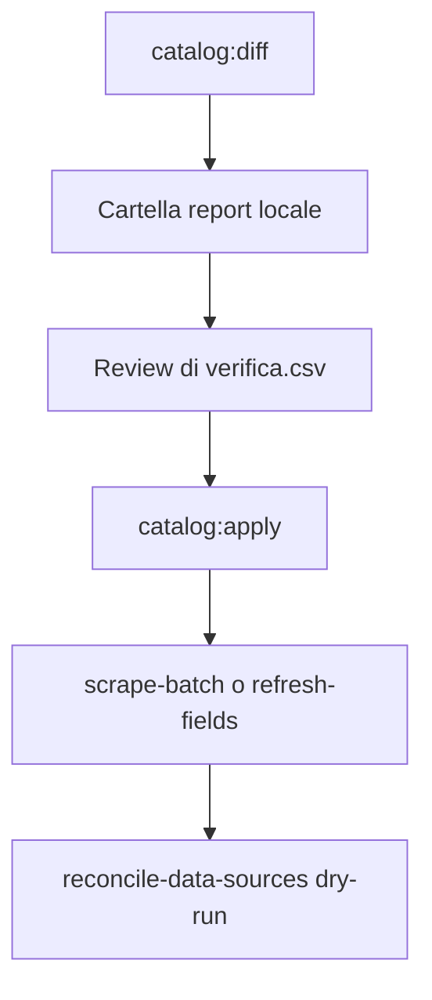

Ogni fine estate gli atenei rinnovano il catalogo. Alcuni cambiano l'anno nell'URL, altri ruotano slug e ritirano corsi. **Prima sistemi gli URL, poi scrapi il contenuto.**

Lo script `diff-catalog` confronta le `data_sources` attive con il catalogo vivo e scrive sempre un report locale. Non tocca lauree, master o corsi: aggiorna solo gli URL, dopo la tua review.

<Note>
Lavora su **develop**, ateneo per ateneo. Produzione solo quando il dry-run di apply su quell'ateneo restituisce *già a posto*.
</Note>

## Due casi

| Caso | Atenei | Cosa succede |
| --- | --- | --- |
| Anno nell'URL | eCampus, Giustino Fortunato, IUL, Leonardo da Vinci | `/2025/` → `/2026/`, `a-a-25-26` → `a-a-26-27` |
| Rotazione catalogo | Pegaso, San Raffaele, Mercatorum e gli altri | slug nuovi, fusioni, pagine ritirate |

## Flusso



<Steps>
  <Step title="Diff">
    Dal repo `laureasi-crawler`:

    ```bash
    npm run catalog:diff -- --university=pegaso --year=2026/2027
    ```

    Servono `SB_URL` e `SB_SERVICE_ROLE_KEY` (accettati anche i nomi `SUPABASE_*`). Per Pegaso e gli atenei Map serve anche `FC_API_KEY`. `--ai` filtra gli URL della mappa con lo stesso filtro già usato da `discover-sources`. `--also-new` crea i corsi Cineca senza sorgente (ampliamento, non riallineamento).
  </Step>
  <Step title="Report">
    Lo script stampa il path di `.local/catalog-reports/<ateneo>-<anno>-<timestamp>/`. Apri i CSV in Excel o Google Sheets.
  </Step>
  <Step title="Review">
    Leggi **verifica.csv** prima di applicare. Le righe `rinomina` / `disattiva` / `crea` stanno in **azioni.csv**.
  </Step>
  <Step title="Apply">
    Il comando da copiare è in `report.md`. Dry-run di default; aggiungi `--apply` per scrivere. `--report-dir=` compila `esito.csv`.
  </Step>
  <Step title="Contenuto">
    Dopo gli URL, lancia `scrape-batch` o `refresh-fields` filtrato su `university_id`, poi `reconcile-data-sources` in `dry_run=true`. Non parte in automatico: costa Firecrawl e va controllato.
  </Step>
</Steps>

## File del report

| File | Contenuto |
| --- | --- |
| `report.md` | Ateneo, adapter, conteggi, comando apply |
| `azioni.csv` | Input di apply (`rinomina`, `disattiva`, `crea`) |
| `verifica.csv` | Match ambigui: non vengono applicati |
| `probe.csv` | Status HTTP o esito API |
| `esito.csv` | Vuoto al diff; lo riempie apply |

## Adapter

- **eCampus** — catalogo Cineca `/api/v1/corsi?anno=YYYY`. Dal 2026 la risposta è un albero (`subgroups[].cds[].cdsSub[].cod`), non una lista piatta `{cds}`: `catalog:diff` cammina entrambi. La rinomina riscrive solo `/corsi/YYYY/` e lascia il resto del path (non forza `/insegnamenti` sui master). Non usare lo status HTTP delle pagine corso: la SPA risponde 200 anche se il `cds` non esiste.
- **Anno nell'URL** — riscrittura + probe. Se il nuovo URL redirige al vecchio, l'anno non è pubblicato.
- **Map** — Firecrawl Map dalla sorgente `universita`, filtrata dalle regex in `FIRECRAWL_MAP_URL_REGEX_BY_HOST`, poi probe HTTP.

<Warning>
La sitemap non è prova di esistenza. Pegaso ha elencato percorsi abilitanti che rispondono 404: lo script non crea una sorgente se il probe fallisce.
</Warning>

## Trappole già viste

- **Pegaso**: sitemap con pagine non pubblicate; non creare senza probe 200.
- **eCampus**: SPA sempre-200; duplicati sullo stesso `cds` e stesso `entity_type` → una rinomina, il resto disattivato. Laurea e `piano_di_studi` sullo stesso CDS si rinomina entrambi. Se il parser Cineca non legge `cdsSub`, il diff vede 0 corsi e disattiva tutto.
- **IUL**: l'a.a. 2026/2027 è online, ma WordPress ha creato post nuovi con suffisso `-2` (LM-91 → `-2-2`). Riscrivere solo l'anno nell'URL redirige ancora al 2025/2026: serve rinomina slug, non `catalog:diff` year.
- **San Raffaele**: coppie `-modalita-fad` / `-modalita-blended` fuse in una pagina.
- **Cusano**: redirect 200 verso la pagina di categoria (soft-404): resta in `verifica`.

## Comandi

```bash
# piano (sempre con report)
npm run catalog:diff -- --university=fortunato --year=2026/2027
npm run catalog:diff -- --university=ecampus --year=2026/2027 --also-new

# apply dopo review
npm run catalog:apply -- --file=.local/catalog-reports/.../azioni.csv --report-dir=.local/catalog-reports/...
npm run catalog:apply -- --file=... --report-dir=... --apply
```

Test della logica (senza rete): `npm run test:catalog`.

Vedi [scrape-batch](/crawler/functions/scrape-batch) e [reconcile-data-sources](/crawler/functions/reconcile-data-sources) per il passo contenuto.
